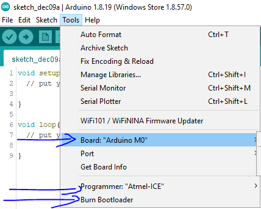

ATSAMD21G18A-AU breakout board with the physical layout inspired by the `Arduino MKR Zero`.


# Power supply

Supply power to 3V3 pin. Or supply power to 5V pin (or USB) and get free 3V3.

# Platformio

`platformio.ini`:
```ini
[env:mzeroUSB]
platform = atmelsam
board = mzeroUSB
```

# Pinout

| Arduino   | SAMD21    | Alternate |
| --:       | --:       | --:       |
| AREF      | PA03      |
| A0        | PA01      | DAC
| A1        | PB08      |
| A2        | PB09      |
| A3        | PA04      |
| A4        | PA05      |
| A5        | PB02      |
| RX        | PA11      | D0
| TX        | PA10      | D1
| ~D2       | PA08      | SDA2
| ~D3       | PA09      | SCL2
| ~D4       | PA14      |
| ~D5       | PA15      |
| D6        | PA20      |
| D7        | PA21      |
| ~D8       | PA06      |
| ~D9       | PA07      |
| ~D10      | PA18      |
| ~D11      | PA16      | SDA3
| ~D12      | PA19      |
| ~D13      | PA17      | SCL3
| SDA       | PA22      |
| SCL       | PA23      |
| MISO      | PA12      |
| MOSI      | PB10      |
| SCK       | PB11      |

# Soldering

Solder every component except U1, J2, J4 and J5. Begin with all the components on the bottom.

Clean board.

Apply current limited (50mA) 5V to GND and 5V pin. Current should be about 6mA. Measure voltage on 3V3 pin, it should be 3.3V. Disconnect. Connect USB, both LEDs should light up again.

Solder U1 carefully. Inspect U1 pins with microscope for shorts or missing soldered pins. Correct when found.


Clean again. Inspect again.

Measure all adjacent signal pins (on headers J4 and J5) for shorts: XIN21, XOUT32, A0, AREF, GND, 3V3, A1, A2, A3, A4, ~D8, ~D9, ~D2, ~D3, TX, RX, 3V3, GND, MOSI, SCK, MISO, PA13 (U1 pin 22), ~D4, ~D5, ~D11, ~D13, ~D10, ~D12, D6, D7, SDA, SCL, USB- (on D1), USB+ (on D2), GND, 3V3, PB22 (U1 pin 37), PB23 (U1 pin 38), PA27 (U1 pin 39), RST, PA28 (U1 pin 41), GND, VDDCORE (on C21), 3V3, CLK (on J2), DIO (on J2), A5 and PB03 (U1 pin 48). Correct shorts when found.

Apply current limited (50mA) to GND and 5V pin. Current should still be about 6mA.

# Bootloader

Before this board behaves like an `Arduino M0` (that you can program with the USB-port) you must first use the `Burn Bootloader`-function from the Arduino IDE. Choose the board `Arduino M0`, then choose your desired `Programmer` then choose `Burn Bootloader`.



# Invisible Blink

Connect USB. A new serial port should appear in the device manager.

Open the example Blink sketch and flash it to the MCU. Measure voltage on GND and ~D13, it should alternate between 0V and 3.3V.

# Done

Done!

[](https://opensource.org/licenses/Apache-2.0)