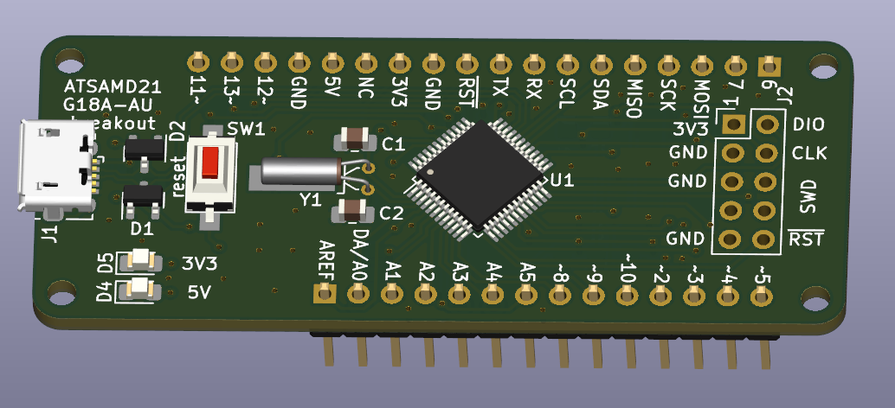

State: untested.



ATSAMD21G18A-AU breakout board with the physical layout inspired by the `Arduino MKR Zero`.

Supply power to 3V3 pin. Or supply power to 5V pin and get free 3V3.

`platformio.ini`:
```ini
[env:mzeroUSB]
platform = atmelsam
board = mzeroUSB
```

Before this board behaves like an `Arduino M0` (that you can program with the USB-port) you must first use the `Burn Bootloader`-function from the Arduino IDE. Choose the board `Arduino M0`, then choose your desired `Programmer` then choose `Burn Bootloader`.

[](https://opensource.org/licenses/Apache-2.0)